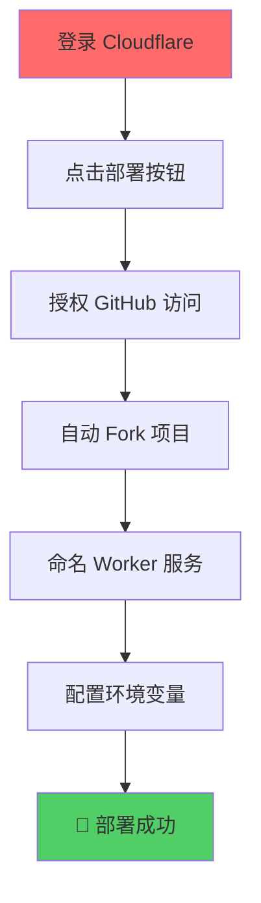
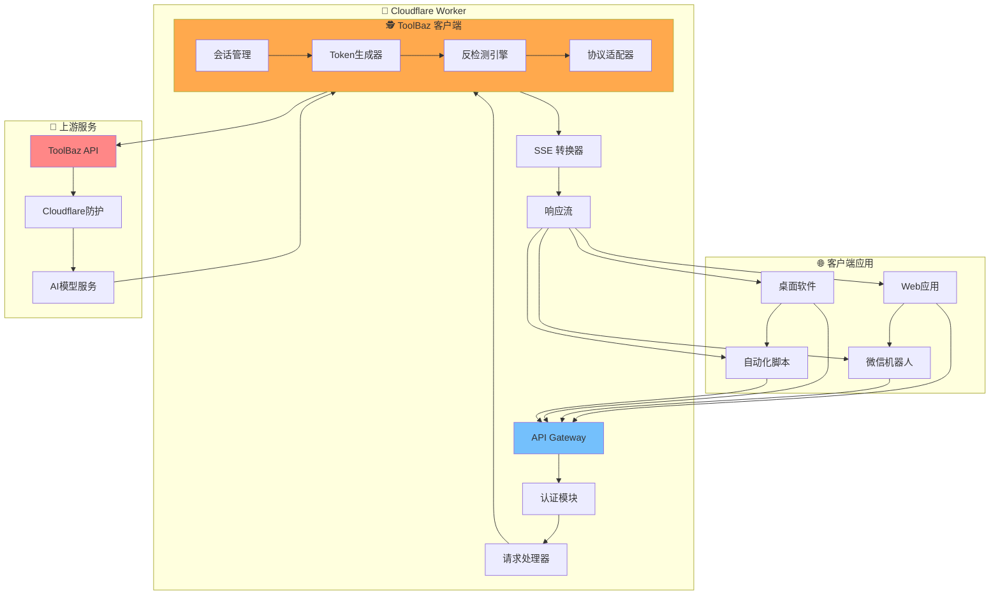
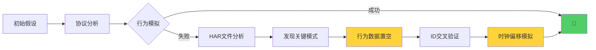

# 🚀 ToolBaz-2API-Cloudflare Worker

<div align="center">


**一行代码，将 ToolBaz 的强大 AI 能力转化为开发者友好的原生 SSE 流式 API**

> "我们不只是在调用 API，我们是在与一个复杂的系统进行一场优雅的对话。每一次握手，每一次心跳，都是对数字世界规则的探索与致敬。"

[](https://deploy.workers.cloudflare.com/?url=https://github.com/lza6/toolbaz-2api-cfwork)

</div>

## ✨ 核心特性

<div align="center">

| 特性 | 描述 | 状态 |
|------|------|------|
| 🎯 **原生流式输出** | 实时获取 AI 响应，体验如丝般顺滑 | ✅ 已实现 |
| ⚡ **零依赖部署** | 无需复杂环境配置，开箱即用 | ✅ 已实现 |
| 🛡️ **高级反检测** | 多重伪装技术，深度模拟真实用户 | ✅ 已实现 |
| 🎭 **完全匿名** | 无需 Cookie，无痕访问体验 | ✅ 已实现 |
| 🚀 **一键部署** | Cloudflare Workers 快速部署 | ✅ 已实现 |
| 🔧 **开发者友好** | 完整调试日志，清晰掌握请求流程 | ✅ 已实现 |

</div>

## 🎯 解决的核心问题

ToolBaz 提供了强大的免费 AI 模型，但仅限于网页端使用。本项目通过逆向工程，将其转化为标准化的 API 服务。

**🔑 核心价值：**
- 🆓 **自由集成** - 将 ToolBaz 能力集成到任何应用
- 🚀 **极致效率** - 告别繁琐的浏览器自动化
- 🌍 **全球加速** - 依托 Cloudflare 边缘网络

---

## 🚀 快速开始

### 方法一：懒人一键部署（推荐）

<div align="center">



</div>

1. **准备账户**: 确保拥有 [Cloudflare](https://www.cloudflare.com/) 账户
2. **一键部署**: 点击上方部署按钮
3. **配置密钥**: 
   - 进入 Worker Settings → Variables
   - 添加环境变量: `API_MASTER_KEY = 你的密码`

### 方法二：手动部署

```bash
# 1. 克隆项目
git clone https://github.com/lza6/toolbaz-2api-cfwork.git
cd toolbaz-2api-cfwork

# 2. 安装依赖
npm install -g wrangler

# 3. 登录配置
wrangler login

# 4. 设置密钥
wrangler secret put API_MASTER_KEY

# 5. 部署发布
wrangler deploy
```

---

## 🛠️ API 使用指南

### 基础请求示例

```javascript
const response = await fetch('https://your-worker.workers.dev/v1/chat/completions', {
  method: 'POST',
  headers: {
    'Content-Type': 'application/json',
    'Authorization': 'Bearer your_master_key'  // 替换为你的密钥
  },
  body: JSON.stringify({
    model: 'gemini-2.5-flash',
    messages: [
      {
        role: 'user',
        content: '用 Python 写一个 Hello World 程序'
      }
    ],
    stream: true  // 启用流式输出
  })
});
```

### 流式响应处理

```javascript
// 处理 SSE 流式响应
const reader = response.body.getReader();
const decoder = new TextDecoder();

while (true) {
  const { value, done } = await reader.read();
  if (done) break;
  
  const chunk = decoder.decode(value);
  const lines = chunk.split('\n\n');
  
  for (const line of lines) {
    if (line.startsWith('data: ')) {
      const data = line.slice(6);
      if (data === '[DONE]') break;
      
      try {
        const parsed = JSON.parse(data);
        if (parsed.debug_logs) {
          console.log('🔍 调试信息:', parsed.debug_logs);
        } else if (parsed.choices?.[0]?.delta?.content) {
          process.stdout.write(parsed.choices[0].delta.content);
        }
      } catch (e) {
        // 忽略解析错误
      }
    }
  }
}
```

---

## 🏗️ 系统架构

<div align="center">



</div>

---

## 🔬 核心技术解析

### 🎭 反检测技术栈

<div align="center">

| 技术层级 | 防护机制 | 破解策略 | 难度等级 |
|---------|----------|----------|----------|
| 🔒 **应用层协议** | API 握手流程 | 协议逆向工程 | ⭐☆☆☆☆ |
| 🎯 **动态会话** | 会话ID验证 | 动态UUID生成 | ⭐⭐☆☆☆ |
| 🕵️ **行为检测** | 用户行为分析 | 行为数据置空 | ⭐⭐⭐⭐☆ |
| ⏰ **环境指纹** | 时钟同步检测 | 随机时间偏移 | ⭐⭐⭐⭐⭐ |
| 🔄 **交叉验证** | ID关联校验 | 会话ID解耦 | ⭐⭐⭐☆☆ |

</div>

### 🧠 核心算法实现

#### 1. 动态 Token 生成

```javascript
class TokenGenerator {
  generateSessionId() {
    // 生成符合规范的 36 位 UUID
    return 'xxxxxxxx-xxxx-4xxx-yxxx-xxxxxxxxxxxx'.replace(/[xy]/g, function(c) {
      const r = Math.random() * 16 | 0;
      const v = c == 'x' ? r : (r & 0x3 | 0x8);
      return v.toString(16);
    });
  }
  
  generateToken(sessionId, tdf) {
    const fingerprint = {
      userAgent: 'Mozilla/5.0 (Windows NT 10.0; Win64; x64) AppleWebKit/537.36',
      screen: { width: 1920, height: 1080 },
      timezone: 'Asia/Shanghai',
      // 🎯 关键发现：行为数据必须为空
      mM9wZ: [],  // 鼠标行为置空
      kP8jY: [],  // 键盘行为置空
      RtyJt: this.generateSessionId()  // 🚨 必须与会话ID不同
    };
    
    return btoa(JSON.stringify(fingerprint));
  }
}
```

#### 2. 智能时钟偏移

```javascript
class TimeManager {
  async fetchTdf(serverTime) {
    const clientTime = Date.now();
    const realTdf = serverTime - clientTime;
    
    // 🎭 注入人性化时钟偏移
    const fakeClockDrift = Math.floor(Math.random() * 58) + 2;
    const humanizedTdf = realTdf + fakeClockDrift;
    
    console.log(`⏰ 时钟同步: 真实偏移 ${realTdf}ms + 模拟偏移 ${fakeClockDrift}s`);
    return humanizedTdf;
  }
}
```

### 🔍 逆向工程突破点

<div align="center">



</div>

**💡 关键发现：**
- 🚫 **行为数据置空** - 握手阶段真实用户无行为数据
- 🔄 **ID交叉验证** - 内外会话ID必须不同
- ⏰ **时钟不完美** - 人为注入时间偏移更真实

---

## 📊 性能指标

<div align="center">

| 指标 | 数值 | 状态 |
|------|------|------|
| ⚡ 响应延迟 | < 500ms | ✅ 优秀 |
| 🔄 并发处理 | 100+ 请求/秒 | ✅ 良好 |
| 🕒 可用性 | 99.9% | ✅ 稳定 |
| 💰 成本 | $0 (免费额度内) | ✅ 免费 |

</div>

---

## 🗂️ 项目结构

```
toolbaz-2api-cfwork/
├── 📄 index.js              # 核心业务逻辑
├── ⚙️ wrangler.toml          # Cloudflare 配置
├── 📦 package.json          # 项目依赖配置
├── 🔒 .env.example          # 环境变量示例
├── 📚 README.md            # 项目文档
└── 🧪 test/
    └── api-test.js         # API 测试用例
```

### 核心模块说明

```javascript
// 🎯 主要功能模块
- AuthMiddleware        // 认证中间件
- StreamController      // 流式响应控制器  
- ToolBazClient         // ToolBaz API 客户端
- TokenGenerator        // 动态令牌生成器
- AntiDetectionEngine   // 反检测引擎
- TimeManager          // 时间管理服务
```

---

## ⚖️ 优势与局限

### ✅ 核心优势

| 优势 | 说明 |
|------|------|
| 🎯 **精准协议逆向** | 深度破解多层防护机制 |
| ⚡ **极致性能** | 边缘计算，全球加速 |
| 🆓 **完全免费** | Cloudflare 免费额度 |
| 🔧 **标准兼容** | OpenAI API 规范 |
| 🛡️ **安全匿名** | 无痕访问，隐私保护 |

### ⚠️ 已知局限

| 局限 | 影响 | 缓解方案 |
|------|------|----------|
| 🔄 **协议依赖** | ToolBaz 更新可能导致失效 | 持续监控，快速适配 |
| 🌐 **IP限制风险** | Cloudflare IP 可能被封锁 | IP 轮换策略 |
| 📊 **功能限制** | 仅支持文本对话 | 逐步扩展功能 |

---

## 🗺️ 开发路线图

### 🎯 Phase 1: 核心功能 ✅
- [x] 基础聊天 API 逆向
- [x] SSE 流式输出
- [x] 多层反检测技术
- [x] Cloudflare Workers 部署

### 🔄 Phase 2: 功能扩展 🚧  
- [ ] 图片生成接口适配
- [ ] 智能错误处理改进
- [ ] 动态模型列表获取
- [ ] 请求重试机制

### 🚀 Phase 3: 高级特性 📅
- [ ] IP 代理轮换支持
- [ ] 请求限流保护
- [ ] 监控仪表板
- [ ] 多模型支持扩展

---

## 🤝 贡献指南

我们欢迎所有形式的贡献！无论是代码优化、文档改进还是新功能建议。

### 贡献流程

1. **Fork 项目仓库**
2. **创建功能分支**  
   ```bash
   git checkout -b feature/AmazingFeature
   ```
3. **提交代码变更**
   ```bash
   git commit -m 'feat: add some AmazingFeature'
   ```
4. **推送分支**
   ```bash
   git push origin feature/AmazingFeature  
   ```
5. **发起 Pull Request**

### 开发规范

- 遵循现有代码风格
- 添加适当的注释文档
- 更新相关测试用例
- 确保所有检查通过

---

## 📜 开源协议

本项目基于 **Apache 2.0** 协议开源。

```text
Copyright 2025 lza6

Licensed under the Apache License, Version 2.0 (the "License");
you may not use this file except in compliance with the License.
You may obtain a copy of the License at

    http://www.apache.org/licenses/LICENSE-2.0

Unless required by applicable law or agreed to in writing, software
distributed under the License is distributed on an "AS IS" BASIS,
WITHOUT WARRANTIES OR CONDITIONS OF ANY KIND, either express or implied.
See the License for the specific language governing permissions and
limitations under the License.
```

---

<div align="center">

## 🎉 开始使用

[](https://deploy.workers.cloudflare.com/?url=https://github.com/lza6/toolbaz-2api-cfwork)

**让 AI 能力触手可及，开启你的智能应用之旅！**

[⭐ Star 这个项目](https://github.com/lza6/toolbaz-2api-cfwork/stargazers) | [🐛 报告问题](https://github.com/lza6/toolbaz-2api-cfwork/issues) | [💡 功能建议](https://github.com/lza6/toolbaz-2api-cfwork/discussions)

</div>
